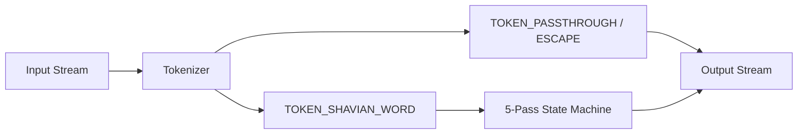

# shavian2tengwar

A Unix-style CLI stream converter written in Python that translates UTF-8 Shavian text (`U+10450`–`U+1047F`) into Everson 2001 / Alcarin Tengwar Private Use Area code points (`U+E000`–`U+E07F`).

## Overview

Traditional English orthography is non-phonetic, making direct English-to-Tengwar transliteration complex and context-heavy. `shavian2tengwar` uses the Shavian alphabet's 40–48 character phonemic system as an Intermediate Representation (IR). By first converting English into Shavian (e.g., via tools like _Shave_), orthographic noise is stripped away, allowing a deterministic 5-pass state machine to map phonemes into Tengwar characters and _tehtar_ (vowel diacritics).

For a note on transliteration philosophy, see [philosophy.md](./philosophy.md). Since font rendering of Tengwar is tricky, see the pdf version at [philosophy.pdf](./philosophy.pdf).

### Key Features

- **Zero Dependencies:** Built exclusively using the Python standard library (`sys`, `re`, `argparse`).
- **Stream-Oriented Pipeline:** Reads from `stdin` or CLI arguments and writes to `stdout`.
- **Passthrough & Escape Tokenization:** Non-Shavian tokens (Latin characters, spaces, punctuation, emojis) pass through unmodified. Verbatim blocks inside `{{...}}` can be retained or stripped using `--strip-escapes`.
- **Step-by-Step Inspector:** Interactive debugging flag (`--inspect`) traces state-machine transitions and byte outputs for any word.
- **Dual Encoding Support:** Defaults to Everson 2001 / Alcarin mapping (`U+E000`–`U+E07F`) while providing `--csur` for legacy CSUR mapping compatibility.
- **Language-Agnostic Test Suite:** Includes an extended 26-case test manifest (`test_cases_everson_3.json`) and runner to validate byte parity across implementations.

---

## Repository Structure

```text
.
├── LICENSE
├── shavian2tengwar.py            # Primary Python CLI & translation engine
├── test_cases_everson_3.json     # Extended 26-case test manifest
└── test_runner.py                # Cross-implementation test harness with flag support
```

---

## Translation Engine Architecture

The engine executes a 5-pass state machine on word-boundary isolated tokens (`TOKEN_SHAVIAN_WORD`) in **Following Consonant Mode** (vowel _tehtar_ attach to the _next_ consonant in the word):



1. **Pass 0 & 1: Normalization, Namer Dot Strip, & Big Five Logograms:**
    - Strips Shavian namer dots (`·`, `U+00B7`).
    - Maps standalone function word abbreviations directly to canonical Appendix E logograms (`𐑞` → _Extended Anta_ `U+E01C`; `𐑝` → _Extended Ampa_ `U+E01D`; `𐑯` → _Ando_ + _Nasal Bar Above_ `U+E004 U+E050`).
2. **Pass 2a & 2b: Clusters & Preconsonantal Nasals:**
    - **Aspirated Wh Cluster:** Intercepts `𐑣𐑢` (/hw/) and emits **_Hwesta_** (`U+E00B`).
    - **Universal Nasals:** Homorganic nasal-stop pairs (`𐑯𐑑`, `𐑯𐑛`, `𐑥𐑐`, `𐑥𐑚`, `𐑙𐑒`, `𐑙𐑜`) always collapse to the stop base carrying a _Nasal Bar Above_ (`U+E050`), attaching any preceding vowel _tehta_ directly to the stop.
3. **Pass 3: Contextual Consonant Selection (`𐑮` /r/):**
    - Emits _Rómen_ (`U+E020`) when followed by a vowel in the word.
    - Emits _Óre_ (`U+E014`) when word-final or followed by a consonant.
4. **Pass 4: Vowel Attachment & Carrier Resolution:**
    - **Short Vowels:** Attach to the following consonant base glyph.
    - **Long Vowels (`𐑰`, `𐑵`):** Attach as double _tehtar_ (`U+E047`, `U+E04D`) on base consonants or flush to _Ára_ (Long Carrier, `U+E02D`).
    - **Rhotic Vowels (`𐑸`, `𐑹`, `𐑺`, `𐑽`, `𐑻`, `𐑼`):** Decompose into `[Tehta]` + _Rómen_ (`U+E020`) or _Óre_ (`U+E014`). _ARRAY/lettER_ (`𐑼`) maps to R-base + _schwa-tehta_ (`U+E045`).
    - **Diphthongs (`𐑲`, `𐑶`, `𐑱`, `𐑬`, `𐑴`, `𐑾`, `𐑿`):** Emit offglide carriers (_Anna_ `U+E016` or _Vala_ `U+E015`) carrying the primary _tehta_.
    - **Orphan / Word-Final Vowels:** Flush to a _Telco_ (Short Carrier, `U+E02E`) or _Ára_ (Long Carrier, `U+E02D`).
5. **Pass 5: Positional Inversions (_Nuquerna_ Flips):** Automatically converts upright _Silme_ (`U+E024`) and _Esse_ (`U+E026`) to _Silme Nuquerna_ (`U+E025`) and _Esse Nuquerna_ (`U+E027`) whenever carrying any top-placed _tehta_ or nasal bar.

---

## Font & Rendering Requirements

Displaying transformed text requires an Everson 2001 or CSUR-compatible Tengwar font.

- **Recommended Font:** **[Alcarin Tengwar](https://github.com/Tosche/Alcarin-Tengwar)** (by Toshi Omagari / Tosche).
    - **macOS & Modern IDE Users:** Download and install _Alcarin Tengwar_ for clean visual rendering in macOS apps, VS Code, and browser text editors. _Alcarin_ is built with native OpenType `mark` / `mkmk` GPOS positioning tables, allowing standard Chromium/HarfBuzz text shapers to anchor diacritics directly over consonant bases without fallback errors.
- **Important Note on _Tengwar Telcontar_:**
    - While _Tengwar Telcontar_ is a popular Tengwar font, it relies on the **SIL Graphite** layout engine to calculate mark positioning.
    - Most modern text editors, terminals, and OS text views do not execute SIL Graphite tables for Private Use Area characters, rendering orphan dotted circles under every _tehta_. Always use an OpenType-native font like _Alcarin Tengwar_.

---

## Usage

### Stream Processing (Pipes & Redirection)

```bash
# Process string via pipe
echo "𐑢𐑦𐑯𐑑𐑼" | python3 shavian2tengwar.py

# Unbraid outer {{ and }} escape markers from verbatim pass-through text
python3 shavian2tengwar.py --strip-escapes < in.md > out.md
```

### Direct Argument Processing

```bash
python3 shavian2tengwar.py "𐑦𐑯 𐑩 𐑣𐑴𐑤 𐑦𐑯 𐑞 𐑜𐑮𐑬𐑯𐑛 𐑞𐑺 𐑤𐑦𐑝𐑛 𐑩 𐑣𐑪𐑚𐑦𐑑"
```

### Interactive Word Inspector (`--inspect`)

Trace character state transitions, carrier flushes, and final hex outputs:

```bash
python3 shavian2tengwar.py --inspect "𐑢𐑦𐑯𐑑𐑼"
```

**Output:**

```text
=== INSPECTING WORD: '𐑢𐑦𐑯𐑑𐑼' [Encoding: Everson 2001 / Alcarin Tengwar (Default)] ===
Pass 1 (Namer Dot Strip): '𐑢𐑦𐑯𐑑𐑼'
Step 0: Char '𐑢' -> Consonant Vala
  [Emit Consonant] Vala (U+E015)
Step 1: Char '𐑦' -> Queue Pending Short Vowel i-tehta
Step 2: Detected Universal Nasal Pair '𐑯𐑑' (Númen + Tinco) -> Stop Tinco + Nasal Bar Above
  [Emit Consonant] Tinco (U+E000)
    └─ Attached Preceding Vowel Tehta: i-tehta (U+E044)
Step 4: Char '𐑼' -> R-Vowel ARRAY/lettER (schwa-tehta) using Óre
  [Emit Consonant] Óre (U+E014)
Final Tengwar Output String: ''
Final Hex Code Points:     U+E015 U+E000 U+E050 U+E044 U+E014 U+E045
```

---

## Testing & Cross-Implementation Verification

The repository includes a test suite driven by `test_cases_everson_3.json`. The runner script pipes inputs to `stdin` and verifies exact byte-level UTF-8 output strings.

### Running Tests

```bash
# Test the Python reference implementation across all 26 cases
python3 test_runner.py --cmd "python3 shavian2tengwar.py" --manifest test_cases_everson_3.json
```
